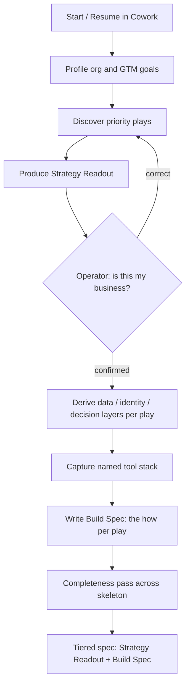
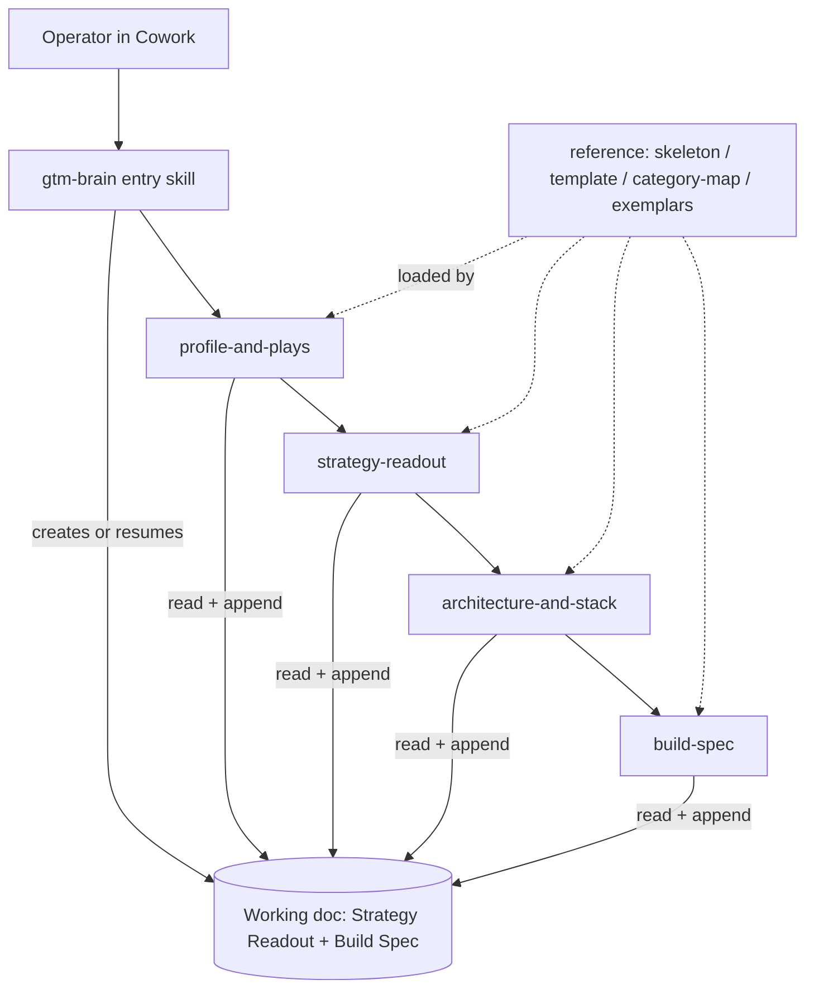

# GTM Brain Plugin - Plan

**Target repo:** [`Dual-Logic/gtm-brain-plugin`](https://github.com/Dual-Logic/gtm-brain-plugin) (private; created 2026-07-22, currently empty), separate from `Dual-Logic/brainRoadshow`. All paths below are plugin-root-relative.

## Goal Capsule

- **Objective:** Build a tool-agnostic Claude Cowork plugin that interviews a business operator and produces a tiered, org-specific GTM-Brain spec (Strategy Readout + Build Spec) — a genuine self-serve build kit for the YPO MarTech Forum.
- **Product authority:** Brady (CGO), Dual Logic GTM. Product Contract below is authoritative for *what*; this plan owns *how*.
- **Execution profile:** Greenfield skill/prompt authoring (SKILL.md + reference docs), not application code. Verification is Cowork dry-runs + output-vs-exemplar review, not a unit-test suite.
- **Stop conditions:** Stop and surface if implementation requires changing the `brainRoadshow` runtime app (out of scope), if a fixed play catalog starts creeping into any skill (violates R3), or if current Cowork plugin conventions differ materially from what U3 assumes.
- **Tail ownership:** Packaging, install doc, and end-to-end validation land in U8.
- **Open blockers:** None. Planning verified current Cowork plugin conventions (see Sources); remaining items are deferred to implementation.

**Product Contract preservation:** unchanged. Enrichment added the Planning Contract, Output Structure, Implementation Units, Verification Contract, and Definition of Done; no requirement (R1–R14) was altered.

---

## Product Contract

### Summary

A Claude Cowork plugin that runs a capable operator (or delegate) through a play-first, multi-phase, resumable interview and produces one org-specific GTM-Brain spec in two linked tiers: a **Strategy Readout** the operator recognizes as their own business, over a **Build Spec** their eng team or technical marketers can stand up a credible v1 from. It rests on a fixed GTM-Brain architecture skeleton with per-org discovered fill, and ships with three archetype exemplar specs.

### Problem Frame

Modern GTM teams can execute infinitely — unlimited outreach, infinite personalized copy — yet pipeline stays hard to build because the bottleneck moved from execution to decision quality. A GTM Brain (a stateful decision system that knows *what to do*) is the answer, but the reference architecture is heavy and technical, out of reach for most operators.

At the YPO MarTech Forum, operators will see the concept demonstrated live (the brainRoadshow runtime). The gap this kit fills is the take-home: a way for each operator to walk out with a spec for *their own* GTM Brain that is credible enough to build, without hiring Dual Logic to produce it. The audience is non-technical business owners on varied stacks, so the kit must make a technical, stack-neutral artifact reachable through a guided conversation.

### Key Decisions

- **Self-serve build kit, not a lead magnet.** The output must stand alone and be buildable without a Dual Logic follow-on. This sets the completeness bar for the Build Spec.
- **Two success criteria become two artifacts.** Resonance and credibility are equally weighted, so the output is tiered: a Strategy Readout (operator-facing) and a Build Spec (technical-team-facing), linked but distinct, matching the operator→tech-team handoff.
- **Hybrid backbone — fixed architecture, discovered plays.** The GTM-Brain layers (evidence/data → identity → fact/decision) and an OODA-style loop are fixed so every output is recognizably a GTM Brain; the plays, data sources, and decision policies are discovered per org.
- **No fixed play catalog.** Plays are discovered through the interview based on what is relevant to this org, and the "how" for each is written into the output. The brainRoadshow demo's plays serve only as the interviewer's reference for probing well — never a menu the operator picks from.
- **Play-first sequencing.** Resonance leads: the interview surfaces the operator's goals and the decisions they most want automated before eliciting architecture, then derives the layers from the chosen plays. A completeness pass prevents layers going under-specified because no chosen play exercised them.
- **Tool-agnostic via named-tool capture.** The interview captures the org's actual tools and the Build Spec maps generic capabilities onto them — stack-neutral yet org-specific. The kit ships no vendor connectors.
- **Multi-phase and resumable — assumes a capable runner.** The experience spans sittings off a persistent working document; it is not idiot-proofed for a non-technical novice because the runner is Cowork-familiar.

### Actors

- A1. **Operator** — GTM leader / economic buyer. Sponsors or runs the interview; primary reader of the Strategy Readout; the resonance test is theirs.
- A2. **Delegate** — RevOps or marketing ops; may run the interview on the operator's behalf.
- A3. **Builder** — eng team or technical marketer; consumes the Build Spec to stand up a v1.
- A4. **Interviewer agent** — the plugin itself; conducts the interview, discovers plays, and writes the tiered spec.

### Key Flows

- F1. **Full interview (multi-phase)**
  - **Trigger:** A1/A2 installs and starts the plugin in Claude Cowork.
  - **Steps:** Profile the org and GTM goals → surface and discover the priority plays → produce and validate the Strategy Readout with the operator → derive the data/identity/decision layers each chosen play needs → capture the named tool stack → write the Build Spec (the "how" per play) → run a completeness pass across the skeleton.
  - **Outcome:** One tiered spec (Strategy Readout + Build Spec) grounded in the org.
- F2. **Resume**
  - **Trigger:** A1/A2 returns in a new session before finishing.
  - **Steps:** The plugin reads the working document, reports what is captured and what is next, and continues from there.
  - **Outcome:** No lost work and no restart from the top.



### Requirements

**Interview experience**
- R1. The plugin runs as a guided, conversational interview a Cowork-familiar operator or delegate can complete across multiple sittings.
- R2. The interview is sequenced play-first: it surfaces the operator's GTM goals and the decisions they most want automated before eliciting any architecture.
- R3. The interview discovers which plays are relevant to this org; it does not present a preset play catalog or menu.
- R4. The interview captures the org's actual named tools in a stack-discovery step so the output can be specific to their environment.
- R5. After the profile and play phases, the interview produces and validates the Strategy Readout with the operator before any build-layer phase proceeds.

**Output spec (tiered)**
- R6. The output is one org-specific spec in two linked tiers: a Strategy Readout (operator-facing, above the fold) and a Build Spec (technical-team-facing, below the fold).
- R7. The Strategy Readout communicates the org's GTM Brain in business language — its purpose, the priority plays, and the decisions it makes for them — and reads as unmistakably about this org.
- R8. The Build Spec specifies, for each relevant play, the "how": the data it needs, its decision logic, and how it is built and run — credible enough that a builder stands up a v1 without returning with basic questions.
- R9. Every output rests on the same fixed GTM-Brain skeleton (evidence/data → identity → fact/decision layers, plus an OODA-style loop), with org-specific detail discovered per interview.
- R10. The Build Spec names required capabilities and maps them to the org's actual tools; it neither ships nor assumes connectors for any specific vendor stack.

**Packaging and continuity**
- R11. The plugin is built to the most recent Claude Cowork plugin conventions, targeting Cowork first; a ChatGPT port is a later, separate effort.
- R12. The interview persists to a working document as it progresses, and each phase operates off and appends to that document.
- R13. On resume, the plugin orients from the working document — reporting what is done and what is next — rather than restarting.

**Archetype exemplars**
- R14. Three archetype specs — mid-market SaaS, professional services, e-commerce — are produced first as the definition of "done" and ship inside the plugin as exemplars that anchor interview output quality.

### Acceptance Examples

- AE1. **Play-gap completeness.** **Given** a chosen play needs a data source the org has not described, **when** the Build Spec is written, **then** it flags the gap and states what is required rather than silently omitting it. **Covers** R8, R2.
- AE2. **Resume mid-interview.** **Given** the operator finished the play phase in a prior session, **when** they restart, **then** the plugin resumes at layer derivation off the working document, not from the top. **Covers** R12, R13.
- AE3. **Tool-agnostic mapping.** **Given** the org uses an uncommon CRM, **when** the Build Spec is produced, **then** it maps the required capability to that named tool without assuming a HubSpot- or Salesforce-specific path. **Covers** R4, R10.
- AE4. **Resonance checkpoint.** **Given** the Strategy Readout is presented, **when** the operator reviews it, **then** they can confirm or correct "this is my business" before any build-layer work proceeds. **Covers** R5, R7.
- AE5. **Mid-phase resume.** **Given** a session ends or compacts partway through a phase (not at a clean boundary), **when** the operator restarts, **then** the plugin reads the phase-progress marker and resumes at the interrupted step without duplicating or losing captured answers. **Covers** R12, R13.
- AE6. **Builder credibility.** **Given** a completed Build Spec, **when** an actual builder (eng or technical marketer, not the plan author) reads it, **then** they can begin a v1 without returning with basic questions, and any capability the interviewer lacks integration knowledge for is flagged as a gap rather than left as vague capability-talk. **Covers** R8, R10.

### Success Criteria

- **Strategy resonance (equal weight):** the operator reads the Strategy Readout and recognizes their business — excited, not generic boilerplate.
- **Build credibility (equal weight):** the eng team or technical marketer can stand up a credible v1 from the Build Spec without coming back with basic questions.
- **Non-generic:** two different orgs produce meaningfully different specs; the output is visibly org-specific.

### Scope Boundaries

**Outside this product's identity**
- The runtime "workspace UI" / app. That role is the brainRoadshow demo shown on stage; this kit is its take-home companion, not a second runtime. This plan makes no changes to `brainRoadshow` — it only reads its play surfaces as interviewer reference.

**Deferred for later**
- The ChatGPT port — Claude Cowork first.
- Wiring integrations or connectors to any vendor stack — the spec names capabilities; building them is not in scope.

### Dependencies / Assumptions

- The brainRoadshow demo (`Dual-Logic/brainRoadshow`) is the on-stage runtime and the conceptual reference; this kit is its companion.
- The GTM Brain concept follows the warmly.ai framing (stateful decision system; evidence/identity/fact layers; OODA+L loop), which informs the fixed skeleton.
- The operator supplies real org inputs (goals, tools, GTM context) for the output to be specific.

### Outstanding Questions

All items are answerable during implementation; none block execution.

**Deferred to implementation**
- Exact `plugin.json` field set against the current schema at build time (see U3).
- The precise plugin-root variable for referencing shared `reference/` files from a skill (`${CLAUDE_PLUGIN_ROOT}` vs. equivalent) — confirm at build (see U4).
- The ChatGPT portability approach — what changes when porting off Cowork.

### Sources / Research

- GTM Brain concept — [warmly.ai, "GTM Brain: Own Your Decisions"](https://www.warmly.ai/p/blog/gtm-brain-own-decisions): three-layer architecture (evidence/identity/fact), OODA+L, the "precision primitive."
- Current Claude Cowork / plugin conventions (2026), verified during planning via the Claude Code plugin and skill docs: `.claude-plugin/plugin.json` manifest, `skills/<name>/SKILL.md` with on-demand reference files, `.plugin` bundle upload, and **no built-in cross-session resume** (the idiom is read/append a working doc).
- [`Dual-Logic/brainRoadshow`](https://github.com/Dual-Logic/brainRoadshow) — the runtime demo (Next.js "Parade" app; Hub / Ingestion / System Map plus ~15 skill surfaces). Its play surfaces are the interviewer's probing reference only.
- Dual Logic **PicassoMD** plugin — the `~~category` tool-agnostic placeholder convention and the configs-outside-the-plugin state pattern (prior-art reference only, not a structure to clone).
- Origin call — [Fireflies "Second brain," 2026-07-22](https://app.fireflies.ai/view/01KY592FY14606QDY3CSR12Z0M) (~40:00–1:07:00).

---

## Planning Contract

### Key Technical Decisions

- KTD1. **New dedicated plugin repo.** Ship as a standalone repo (`Dual-Logic/gtm-brain-plugin`), not nested in brainRoadshow's Next.js app. It is self-contained (skills + reference docs) and distributes as a `.plugin` bundle. *Rationale:* clean separation from the runtime demo; portable install.
- KTD2. **One skill per interview phase + a thin `gtm-brain` orchestrator.** Cowork has no built-in cross-session resume, so the plugin is a set of phase skills plus an entry skill; each phase skill reads the working doc, runs its phase, and appends. Per-phase decomposition (over a single doc-driven skill) is chosen for context economy — each skill loads only its phase's reference slice — plus modular authoring and clear per-phase triggers. *Serves* R1, R12, R13.
- KTD3. **Persistent working doc in the operator's project root, outside the plugin.** The interview reads/writes a single in-progress spec doc (Strategy Readout + Build Spec) in the user's project, not inside the plugin, so it survives plugin updates and enables resume. *Grounded in* the Cowork read-state-file idiom and the PicassoMD configs-outside-plugin pattern. *Serves* R12, R13.
- KTD4. **Tool-agnostic via `~~category` placeholders + named-tool capture.** Skills reference capability categories (`~~CRM`, `~~email`, `~~web/product analytics`, `~~ads`, `~~data warehouse`, `~~enrichment`); the interview captures the org's actual named tools into the working doc; the Build Spec maps capabilities → those named tools. No vendor connectors shipped. *Convention proven in Dual Logic's PicassoMD plugin.* *Serves* R4, R10.
- KTD5. **Fixed skeleton ships as a reference doc; plays discovered.** The GTM-Brain architecture skeleton (evidence/identity/fact layers + OODA loop) ships as a reference file every phase skill reads; plays are discovered per org with no catalog surfaced. The brainRoadshow play surfaces are copied into the reference at authoring time (a snapshot the owner refreshes as needed) and used only as the interviewer's probing hints — never read live, never enumerated to the operator — preserving R3. *Serves* R3, R9.
- KTD6. **Three archetype specs authored first** as the output template's proof and as few-shot exemplars the skills load to anchor quality. *Serves* R14; sequencing driver.
- KTD7. **Distribution: `.plugin` bundle for Cowork upload.** Package for direct Cowork upload (marketplace/git optional); include a non-dev install doc. *Serves* R11.

### High-Level Technical Design

Plugin components centered on the working doc: the `gtm-brain` entry skill creates/resumes the working doc; four phase skills read the shared `reference/` docs and read-then-append the working doc in sequence.



### Assumptions

- Current Cowork plugin conventions hold as researched: `.claude-plugin/plugin.json` manifest, `skills/<name>/SKILL.md`, supporting files loaded on demand, `.plugin` bundle install. (`.mcp.json` exists for connector-based plugins, but this one ships none — see U4.) Verify the live schema at U3.
- A capable, Cowork-familiar operator or delegate runs the interview (per Product Contract) — the resume UX need not be novice-proof.

### Sequencing

Four phases, dependency-ordered:

- **A — Define the deliverable:** U1 (template + skeleton) → U2 (exemplars). U3 (scaffold) runs in parallel.
- **B — Conventions:** U4 (tool-agnostic + working-doc convention) after U3.
- **C — Interview skills:** U5 (entry/resume) → U6 (strategy tier) → U7 (build tier).
- **D — Ship:** U8 (package + validate) after U1–U7.

---

## Output Structure

```text
gtm-brain-plugin/                    # new dedicated repo; ships as a .plugin bundle
├── .claude-plugin/
│   └── plugin.json                  # manifest (verify current schema)
├── README.md                        # what it is + non-dev install guide
├── CONNECTORS.md                    # ~~category → tool mapping
├── skills/
│   ├── gtm-brain/SKILL.md           # entry / orchestrator + resume
│   ├── profile-and-plays/SKILL.md   # Phase 1: profile + discover plays
│   ├── strategy-readout/SKILL.md    # Phase 2: produce + validate readout
│   ├── architecture-and-stack/SKILL.md  # Phase 3: derive layers + capture tools
│   └── build-spec/SKILL.md          # Phase 4: Build Spec + completeness pass
└── reference/                       # shipped docs the skills load on demand
    ├── gtm-brain-skeleton.md        # fixed architecture skeleton + OODA loop
    ├── working-doc-template.md      # the tiered output doc scaffold
    ├── category-map.md              # ~~category capability catalog
    └── exemplars/
        ├── mid-market-saas.md
        ├── professional-services.md
        └── e-commerce.md
```

The tree is a scope declaration, not a constraint — the implementer may adjust if a better layout emerges. Per-unit `Files` are authoritative.

---

## Implementation Units

### U1. Output spec template + fixed skeleton reference

- **Goal:** Define the tiered output doc (Strategy Readout + Build Spec) and the fixed GTM-Brain skeleton — the shipped reference the interview builds against.
- **Requirements:** R6, R7, R8, R9, R12
- **Dependencies:** none
- **Files:** `reference/working-doc-template.md`, `reference/gtm-brain-skeleton.md`
- **Approach:** Template has two tiers — Strategy Readout (business language: the brain's purpose, priority plays, the decisions it makes) above the fold; Build Spec (per-play: data needs, decision logic, build/run "how", capability→tool mapping) below. It also carries a **phase-progress block** at the top — phase pointer + last-completed step + the captured raw inputs (not only the synthesized output) — so any phase skill can resume from an interruption; U4 documents how it is read and written. Skeleton documents the evidence/identity/fact layers + OODA loop as the fixed backbone with placeholders for discovered fill.
- **Patterns to follow:** warmly three-layer model + OODA+L (see Sources); brainRoadshow play surfaces as the play vocabulary.
- **Test scenarios:** `Test expectation: none -- content authoring.` Review checks: template exposes both tiers with a clear above/below-the-fold boundary; skeleton names all three layers plus the loop; a reviewer can fill it without inventing structure.
- **Verification:** U2 exemplars conform to this template without structural gaps.

### U2. Three archetype exemplar specs

- **Goal:** Author complete filled specs for mid-market SaaS, professional services, and e-commerce — the definition of "done" and the few-shot exemplars.
- **Requirements:** R14 (demonstrates R6–R10)
- **Dependencies:** U1
- **Files:** `reference/exemplars/mid-market-saas.md`, `reference/exemplars/professional-services.md`, `reference/exemplars/e-commerce.md`
- **Approach:** Each exemplar walks the full tiered output for a realistic org of that archetype, with distinct priority plays, tools, and decision policies so they read as genuinely different; each maps capabilities to named tools (demonstrating tool-agnosticism).
- **Patterns to follow:** U1 template; brainRoadshow plays as candidate plays.
- **Test scenarios:** `Covers AE3.` Review checks: two archetypes produce meaningfully different specs (non-generic criterion); each exemplar is credible to a technical reader.
- **Verification:** three complete, visibly distinct exemplars conform to the U1 template.

### U3. Plugin scaffold + manifest

- **Goal:** Stand up the plugin repo to current Cowork conventions: `.claude-plugin/plugin.json`, layout, README stub.
- **Requirements:** R11
- **Dependencies:** none (parallel with U1/U2)
- **Files:** `.claude-plugin/plugin.json`, `README.md`
- **Approach:** Verify the current `plugin.json` schema, then author it (name `gtm-brain`, version, description, skills path); establish the root layout (`skills/` and `reference/` at root, per current conventions).
- **Patterns to follow:** current Claude plugin conventions (Sources); PicassoMD `plugin.json` as a shape reference only, not a template to clone.
- **Test scenarios:** `Test expectation: install smoke.` Plugin loads in Cowork with no manifest error and the manifest validates. (Skill discoverability is verified at U5/U8, once `skills/gtm-brain/SKILL.md` exists.)
- **Verification:** clean install/load in Cowork with a valid manifest.

### U4. Tool-agnostic capability layer + working-doc/resume convention

- **Goal:** Define the `~~category` capability map (`category-map.md` + `CONNECTORS.md`) and the working-doc persistence/resume convention. Ship **no `.mcp.json`**: the interview asks about the org's tools, it never calls them, so the plugin declares no connectors (R10). If the current Cowork manifest requires the file to exist at all, ship it empty and say so — never with vendor defaults.
- **Requirements:** R4, R10, R12, R13
- **Dependencies:** U1, U3
- **Files:** `CONNECTORS.md`, `reference/category-map.md`
- **Approach:** Enumerate GTM-relevant capability categories (CRM, email, web/product analytics, ads, data warehouse, enrichment, conversation intelligence); document how skills reference `~~category` in prose only (no MCP config). Define where the working doc lives in the operator's project, the read-then-append contract, and the resume-orientation behavior — including the **phase-progress marker** (phase pointer + last-completed step) the U1 template carries and a per-section append cadence, so a mid-phase interruption resumes cleanly, not only clean phase boundaries. The contract also has each phase skill **check the marker and decline to run out of sequence** (guarding against Cowork description-match auto-triggering). Confirm the plugin-root reference variable for loading shared `reference/` files.
- **Patterns to follow:** PicassoMD `~~category` and configs-outside-plugin conventions.
- **Test scenarios:** `Covers AE2, AE3, AE5.` A skill resolves a capability to a named tool via the convention (prose, no MCP config); working-doc convention supports pause/resume at both phase boundaries and mid-phase; a phase skill invoked out of order defers to the marker.
- **Verification:** resume contract (incl. mid-phase + ordering guard) and capability→tool resolution are documented and referenced by U5–U7; no `.mcp.json` with vendor defaults ships.

### U5. Entry/orchestrator skill (`gtm-brain`) + resume

- **Goal:** The kickoff skill: creates the working doc from the template, explains the flow, routes to phase skills; on resume, reads the working doc, reports state, points to the next phase.
- **Requirements:** R1, R12, R13
- **Dependencies:** U1, U3, U4
- **Files:** `skills/gtm-brain/SKILL.md`
- **Approach:** On first run, create the working doc in the project root from the U1 template and route to Phase 1. On re-run, detect the existing working doc, read the phase-progress marker, summarize done/next, and route to the correct phase — resuming mid-phase when the marker indicates an interrupted step. SKILL.md frontmatter: `name`, `description`, user-invocable.
- **Patterns to follow:** Cowork read-state-file resume idiom; current SKILL.md conventions.
- **Test scenarios:** `Covers AE2, AE5.` Fresh start creates the working doc and routes to Phase 1; re-run resumes at the right phase — and the right mid-phase step — not the top.
- **Verification:** dry-run of start and of resume both behave correctly in Cowork.

### U6. Strategy-tier skills (profile + play discovery + Strategy Readout)

- **Goal:** The play-first phases that produce and validate the Strategy Readout.
- **Requirements:** R2, R3, R5, R7
- **Dependencies:** U1, U2, U3, U4, U5
- **Files:** `skills/profile-and-plays/SKILL.md`, `skills/strategy-readout/SKILL.md`
- **Approach:** `profile-and-plays` interviews for GTM goals and discovers relevant plays (no menu; probes using the brainRoadshow play surfaces as reference), appending to the working doc. `strategy-readout` synthesizes the operator-facing readout and runs the resonance checkpoint ("is this your business?") before any build-tier phase; loops back on correction.
- **Patterns to follow:** play-first sequencing (KTD5); skeleton reference.
- **Test scenarios:** `Covers AE4.` Play discovery yields org-specific plays with no fixed catalog surfaced; the readout gates progression on operator confirmation.
- **Verification:** dry-run yields an org-specific Strategy Readout; the checkpoint blocks progression until confirmed.

### U7. Build-tier skills (architecture + stack capture, Build Spec + completeness pass)

- **Goal:** Derive the architecture layers each play needs, capture the named tool stack, write the Build Spec, and run the completeness pass.
- **Requirements:** R4, R8, R9, R10
- **Dependencies:** U1, U2, U3, U4, U6
- **Files:** `skills/architecture-and-stack/SKILL.md`, `skills/build-spec/SKILL.md`
- **Approach:** `architecture-and-stack` derives the evidence/identity/fact-layer and decision-policy needs per chosen play and captures the org's named tools. `build-spec` writes the per-play "how", stating each play's **capability contract** (inputs, outputs, trigger) and mapping capabilities → named tools; it then runs a completeness pass that flags gaps rather than omitting them — both **data gaps** (a play needs data the org has not described) and **integration-knowledge gaps** (a named tool the interviewer cannot credibly specify how-to for), so the spec never degrades into vague capability-talk.
- **Patterns to follow:** `~~category` mapping (KTD4); skeleton reference.
- **Test scenarios:** `Covers AE1, AE3, AE6.` Build Spec is credible per-play (capability contract present); data and integration-knowledge gaps flagged not omitted; capabilities map to the org's named tools.
- **Verification:** dry-run yields a Build Spec a technical reader finds credible; the completeness pass flags a deliberately-omitted data source.

### U8. Package, install docs, end-to-end validation

- **Goal:** Package the `.plugin` bundle, write the non-dev install/handoff doc, and validate end-to-end against an archetype (reproduces exemplar-grade output; resume works).
- **Requirements:** R11, R14 (validates R1–R10)
- **Dependencies:** U1–U7
- **Files:** `README.md` (install guide), `CONNECTORS.md`, the built `.plugin` bundle
- **Approach:** Build the `.plugin`; write install steps for a non-dev operator (upload into Cowork); run the full interview against, e.g., the mid-market SaaS archetype and compare the output to that exemplar; simulate a session break (including mid-phase) to confirm resume. Then run a second end-to-end pass against an **uncommon/non-default stack** and have an **actual builder (not the plan author)** attempt a v1 from the Build Spec, recording whether it triggers basic questions (AE6). Run the interview against a **second, distinct org profile** and confirm the two specs diverge on plays, tools, and decision policies (non-generic criterion).
- **Patterns to follow:** PicassoMD bundle/install docs as a shape reference.
- **Test scenarios:** `Covers AE1–AE6` end-to-end. A clean install + full run reproduces an exemplar-grade tiered spec; resume works across a break (incl. mid-phase); a real builder starts a v1 from an uncommon-stack Build Spec without basic questions; two distinct profiles yield divergent specs.
- **Verification:** the full interview produces a spec meeting both success criteria — resonance (operator checkpoint) and build credibility (real-builder review on an uncommon stack, no basic questions); resume verified at phase boundaries and mid-phase; two profiles diverge.

---

## Verification Contract

No automated test suite exists for a prompt/skill plugin; verification is behavioral, run in Claude Cowork.

| Gate | How | Applies to |
|---|---|---|
| Install smoke | Plugin loads in Cowork with no manifest error; skills discoverable | U3, U8 |
| Skill dry-run | Each skill, run in Cowork, produces the expected working-doc reads/appends | U5, U6, U7 |
| Exemplar conformance | U2 exemplars match the U1 template; two archetypes are visibly distinct | U1, U2 |
| Acceptance examples | AE1 (play-gap flag), AE2 (resume), AE3 (tool-agnostic mapping), AE4 (resonance checkpoint), AE5 (mid-phase resume), AE6 (builder credibility) all pass | U4–U8 |
| Builder credibility | A real builder (not the author) starts a v1 from a Build Spec produced against an uncommon stack, with no basic questions | U7, U8 |
| Non-generic | Two distinct org profiles yield specs that diverge on plays, tools, and decision policies | U8 |
| End-to-end | Full interview against ≥1 archetype reproduces exemplar-grade output; resume across a session break (incl. mid-phase) | U8 |

---

## Definition of Done

**Global**
- All 8 units complete; plugin installs cleanly in Cowork.
- A full interview against at least one archetype reproduces exemplar-grade tiered output meeting both success criteria (resonance + build credibility).
- Build credibility validated by a real builder (not the author) starting a v1 from an uncommon-stack Build Spec without basic questions (AE6); two distinct org profiles produce meaningfully different specs (non-generic).
- Resume verified across a simulated session break — at phase boundaries and mid-phase (AE2, AE5).
- Tool-agnostic mapping verified for a non-default stack (AE3); no fixed play catalog surfaced in any skill (R3).
- Three archetype exemplars shipped; non-dev install doc usable without developer help.
- No changes made to `brainRoadshow`.
- Abandoned/experimental scaffold removed from the final bundle.

**Per unit:** each unit's Verification line is satisfied and its cited requirements are advanced.
