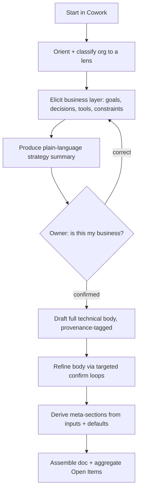
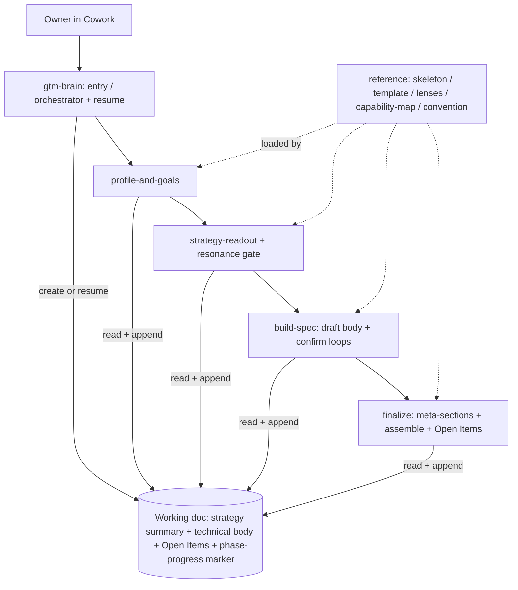

# GTM Brain Plugin - Plan

## Goal Capsule

- **Objective:** A Claude Cowork plugin — a set of skills — that interviews a non-technical business owner in ~30–60 minutes and produces one org-specific GTM Brain document: a plain-language strategy summary over a full, provenance-tagged, builder-ready technical spec, for any business type.
- **Product authority:** Brady (CGO), Dual Logic GTM. The Product Contract is authoritative for *what*; this plan owns *how*.
- **Execution profile:** Greenfield skill/prompt authoring (SKILL.md + reference docs), not application code. Verification is Cowork dry-runs and output-vs-template review, not a unit-test suite.
- **Stop conditions:** Stop and surface if any skill starts surfacing a preset catalog or menu of decisions or archetype lenses to the owner (violates R3 and KTD5 — lenses and decisions are discovered per org, never picked from a menu), if producing the technical body requires the owner to author technical content (violates the propose-and-confirm posture, R6), or if current Cowork plugin conventions differ materially from the Assumptions below.
- **Tail ownership:** Packaging, install doc, and end-to-end validation land in U8.
- **Open blockers:** None. The multi-sitting resume fork is resolved — full resume is in scope; remaining items are deferred to implementation.
- **Product Contract preservation:** unchanged. Enrichment adds the Planning Contract, Output Structure, Implementation Units, Verification Contract, and Definition of Done; no requirement (R1–R16) was altered.

---

## Product Contract

### Summary

A Claude Cowork plugin (a set of skills) that walks a non-technical business owner through a ~30–60 minute conversation and produces one org-specific GTM Brain document: a plain-language strategy summary over a technical spec a builder or vendor can execute. Every material technical claim is provenance-tagged, and the doc auto-assembles its own Open Items handoff list.

### Problem Frame

The GTM Brain reference architecture is powerful but heavy and technical — out of reach for the business owners who would benefit most. At venues like the YPO MarTech Forum, owners grasp the concept when they see it but cannot produce a spec for their own brain without hiring a firm to write it.

The person in the chair is non-technical, new to the GTM Brain model, on an unknown tech stack, in any industry. They can describe their business, their goals, and name their tools — they cannot author "bi-temporal fact store" or "uplift model on discount depth." The cost of the gap is that the concept lands but nothing buildable leaves the room. What is missing is a guided path for such an owner to walk out in an hour holding a credible, org-specific spec their technical person or vendor can execute.

### Key Decisions

- **One document, two audiences.** The output is a single tiered doc: a business-readable strategy summary that paints the end-state picture, over a builder-ready technical body. This matches the owner→technical-person handoff the owner described.
- **Propose-and-confirm bridge.** The owner cannot author the technical body, so the plugin proposes the data, identity approach, decision logic, and architecture from the business layer, and the owner ratifies or corrects in plain language. They react; they never author.
- **Full template, propose-derived.** Every section is present, including the meta-sections (roadmap, cost, risk, team, maturity). The owner's active hour goes to the business layer; the plugin derives the technical body and meta-sections from those inputs plus sensible defaults.
- **Universal skeleton, archetypes as lenses.** One shared GTM-Brain skeleton underlies every output; the three templates are emphasis libraries the interviewer borrows from (or blends), not molds. This is what makes any business type coverable while staying org-specific.
- **Three-way provenance tags.** Every material technical decision is marked `[Stated]`, `[Proposed — confirmed]`, or `[Open — needs your team]`, so a builder can separate load-bearing owner intent from plugin inference. The Open Items list is an aggregation of these tags, not a separately maintained section.
- **Skill decomposition — phase-pipeline backbone with draft-then-confirm for the body.** Skills follow the conversation arc (resumable, context-economical); the owner drives the business layer conversationally, then the plugin drafts the full technical body and refines it through provenance-driven confirm loops rather than interrogating the owner layer by layer.
- **Multi-sitting, resumable off a persistent working document.** The interview persists to a working document in the owner's project as it progresses; each phase reads then appends, and a fresh session detects where it left off — including mid-phase — and continues rather than restarting. This adds a thin entry/orchestrator skill and a phase-progress marker.
- **Light just-in-time education.** Because the owner is new to the model, the plugin teaches only enough for them to give good inputs and understand the strategy summary — framing, not a tutorial.

### Actors

- A1. **Owner** — the non-technical business owner / economic buyer. Runs the interview, is the primary reader of the strategy summary, and owns the resonance test.
- A2. **Builder / vendor** — a technical person or firm (e.g. Dual Logic) who consumes the technical body plus Open Items to stand up a v1.
- A3. **Interviewer agent** — the plugin itself; orients the owner, elicits the business layer, drafts and confirms the technical body, and assembles the document.

### Key Flows

- F1. **Full interview**
  - **Trigger:** A1 installs and starts the plugin in Claude Cowork.
  - **Steps:** Orient the owner and classify the org to an archetype lens → elicit the business layer (goals, the decisions they most want automated, named tools, constraints) → produce the plain-language strategy summary and run the resonance check → generate the full technical body as a provenance-tagged draft and refine it through targeted confirm loops → derive the meta-sections → assemble the tiered document and aggregate Open Items.
  - **Outcome:** One org-specific document, business summary over builder-ready spec, with an Open Items handoff list.
- F2. **Resume**
  - **Trigger:** A1 returns in a new session before finishing.
  - **Steps:** The plugin reads the working document, reports what is captured and what remains, and continues from the recorded point — including mid-phase.
  - **Outcome:** No lost work and no restart from the top.



### Requirements

**Interview experience**
- R1. The plugin runs as a guided conversation a non-technical owner can complete in ~30–60 minutes, mostly by reacting to proposals rather than authoring content.
- R2. The plugin orients the owner to the GTM Brain concept with light just-in-time framing — enough to give good inputs and read the strategy summary, not a tutorial.
- R3. The interview classifies the org and selects the closest archetype lens (or blends two) to shape emphasis, without forcing the org into an archetype.
- R4. The interview elicits the business layer the owner can drive: GTM goals, the decisions they most want automated, their actual named tools, and key constraints.
- R5. The plugin produces the strategy summary and runs a resonance check ("is this your business?") before the technical body is finalized, looping back on correction.

**Bridge and output posture**
- R6. The plugin fills the entire template via propose-and-confirm — the owner ratifies or corrects proposals rather than authoring technical content, and the doc is never left thin.
- R7. Every material technical decision in the body carries a provenance tag: `[Stated]`, `[Proposed — confirmed]`, or `[Open — needs your team]`.
- R8. The doc auto-aggregates an Open Items / Next Steps section from the `[Open]` items and higher-risk `[Proposed]` items, forming the agenda for the builder/vendor handoff.

**Output document**
- R9. The output is one document in two linked tiers: a business-readable strategy summary that paints the end-state picture, over a builder-ready technical spec.
- R10. Every output rests on one fixed universal GTM-Brain skeleton (sources/evidence → identity → facts → decisions → learning, plus an OODA-style loop), with org-specific fill.
- R11. The document includes the full template — the architecture body plus the meta-sections (phased roadmap, cost model, risk register, team sizing, maturity self-assessment) — derived from the owner's inputs and sensible defaults where the owner cannot supply them.
- R12. The technical body names required capabilities and maps them to the org's actual named tools; the plugin ships no vendor connectors and assumes no specific stack.
- R13. The document reads as unmistakably about this org, such that two different businesses produce meaningfully different docs.

**Packaging**
- R14. The plugin is built to current Claude Cowork plugin conventions and distributed so a non-developer can install it.

**Continuity**
- R15. The interview persists to a working document in the owner's project as it progresses; each phase reads then appends to that document.
- R16. On a new session, the plugin orients from the working document — reporting what is captured and what is next — and resumes at the correct point, including mid-phase, rather than restarting.

### Acceptance Examples

- AE1. **Resonance gate.** Given the strategy summary is presented, when the owner reviews it, then they can confirm or correct "this is my business" before the technical body is finalized. Covers R5, R9.
- AE2. **Provenance separation.** Given a completed document, when a builder reads the body, then each material decision is tagged so they can distinguish owner intent from plugin inference from open gaps. Covers R7, R8.
- AE3. **Off-archetype coverage.** Given the org is a manufacturer (none of the three archetypes), when the document is produced, then it still rests on the universal skeleton and reads as that org's business, flagging more `[Open]` items rather than forcing a SaaS/PS/e-commerce mold. Covers R3, R10, R13.
- AE4. **Tool-agnostic mapping.** Given the org uses an uncommon CRM, when the technical body is produced, then it maps the required capability to that named tool without assuming a HubSpot- or Salesforce-specific path. Covers R4, R12.
- AE5. **Gap honesty.** Given a capability needs data the owner did not supply, when the document is written, then it flags the gap as `[Open]` and routes it to Open Items rather than silently omitting or fabricating it. Covers R6, R8.
- AE6. **Novice completes it.** Given a non-technical owner with ~an hour, when they run the interview, then they produce a full document by reacting to proposals, never being asked to author technical content. Covers R1, R6.
- AE7. **Resume mid-interview.** Given the owner ended a session partway through a phase, when they restart, then the plugin reads the working document and resumes at the interrupted step without duplicating or losing captured answers. Covers R15, R16.

### Success Criteria

- **Strategy resonance:** the owner recognizes their business in the summary — excited, not generic boilerplate.
- **Build credibility:** a builder or vendor can start a v1 from the body plus Open Items without returning with basic questions.
- **Honest completeness:** the document is fully populated, yet the provenance tags and Open Items make clear what is verified versus assumed.
- **Non-generic:** two different orgs produce meaningfully different documents.
- **Time:** a non-technical owner completes the interview in ~30–60 minutes.

### Scope Boundaries

**Outside this product's identity**
- The runtime GTM Brain application. This product produces the spec; a builder or vendor executes it. The on-stage runtime demo (brainRoadshow) is a separate thing this plugin does not modify.
- Vendor connectors and integrations. The document names capabilities and maps them to named tools; it wires nothing and calls no tools.

**Deferred for later**
- A ChatGPT port — Claude Cowork first.

### Dependencies / Assumptions

- The three provided architecture templates (SaaS, professional services, e-commerce), saved under [docs/](docs/), are the archetype lens library and the output-quality bar; they ship with the plugin as reference lenses.
- The owner supplies real org inputs (goals, tools, GTM context) for the output to be specific.
- The GTM Brain concept follows the layered / OODA+L framing the templates encode; the universal skeleton is the shared spine across the three variants.
- Current Claude Cowork plugin conventions hold as researched; the live manifest schema is confirmed at build.

### Outstanding Questions

All items are answerable during planning; none block it.

**Deferred to planning**
- The working-document location and phase-progress marker mechanics — where the doc lives in the owner's project and how resume detects the interrupted step.
- Output format and polish of the leave-behind (a Markdown working doc versus an exportable, branded document) — affects the "board-ready" promise.
- Exact plugin manifest fields against the current Cowork schema.
- How the universal skeleton is authored from the three templates — extract the shared spine plus per-lens emphasis deltas.

### Sources / Research

- The three GTM Brain architecture templates (SaaS, professional services, e-commerce) plus a base template, saved under [docs/](docs/) — the input decomposed here and the quality bar for output.
- `Dual-Logic/brainRoadshow` — the on-stage runtime demo and conceptual companion; this plugin does not modify it.

---

## Planning Contract

### Key Technical Decisions

- KTD1. **Standalone greenfield plugin.** Ship this dedicated repo as a self-contained Claude Cowork plugin (skills + reference docs), distributed as an installable bundle. *Serves* R14.
- KTD2. **Five skills — one entry/orchestrator plus four phase skills.** `gtm-brain` (entry/resume) routes to `profile-and-goals`, `strategy-readout`, `build-spec`, and `finalize`. Per-phase decomposition gives context economy — each skill loads only its reference slice — plus clean resume boundaries and clear per-phase triggers. *Serves* R1, R15, R16 and the skill-decomposition Key Decision.
- KTD3. **Persistent working doc in the owner's project, outside the plugin.** The interview reads/appends one working document (strategy summary + technical body + Open Items) in the owner's project so it survives plugin updates and enables resume. Within a phase, the draft-then-confirm and resonance-correction loops revise that phase's own working section in place; across phases, each completed phase appends its section — so "append" is section-level accretion, not a ban on revising the active draft. *Serves* R15, R16.
- KTD4. **Draft-then-confirm for the technical body.** `build-spec` generates the full body as a provenance-tagged draft, then refines it through targeted confirm loops ordered by risk and bounded to protect the time budget (highest-risk `[Proposed]` items first; stop once the remaining items are low-risk) — not layer-by-layer interrogation. *Serves* R6, R7 and the skill-decomposition Key Decision.
- KTD5. **Universal skeleton ships as a reference; lenses are emphasis-only.** One `reference/gtm-brain-skeleton.md` is the fixed backbone every phase reads; the three templates ship as archetype lenses used to shape emphasis (or blend, or fall back to the universal skeleton for off-archetype orgs), never as molds or menus surfaced to the owner. *Serves* R3, R10, R13.
- KTD6. **Tool-agnostic via capability categories + named-tool capture.** Skills reference capability categories in prose; the interview captures the org's actual named tools into the working doc; the body maps capabilities → those tools. No connectors shipped, and no `.mcp.json` with vendor defaults — if the manifest requires the file to exist, ship it empty and say so. *Serves* R4, R12.
- KTD7. **Provenance tags are a template convention, not tooling.** The output template defines the `[Stated]` / `[Proposed — confirmed]` / `[Open — needs your team]` markers inline; `finalize` aggregates `[Open]` plus higher-risk `[Proposed]` into the Open Items section. *Serves* R7, R8.

### High-Level Technical Design

Components center on the working doc: the `gtm-brain` entry skill creates or resumes it; four phase skills read the shared `reference/` docs and read-then-append the working doc in sequence, each guarding against out-of-order invocation by checking the phase-progress marker.



### Assumptions

- Current Cowork plugin conventions hold: a `.claude-plugin/plugin.json` manifest, `skills/<name>/SKILL.md` with on-demand reference files, an installable bundle, and no built-in cross-session resume (the idiom is read/append a working doc). Verify the live manifest schema at U4.
- The owner (or a delegate) runs the interview in Cowork and can react to proposals in plain language; the resume UX need not be novice-proof beyond reading the working doc.
- The three provided architecture templates are the authoritative source for both the universal skeleton (their shared spine) and the archetype lenses (their per-variant emphasis).
- Prior-build artifacts exist on disk (a v0.1.0 bundle under `dist/` and an earlier `-001-` plan) but are explicitly out of scope for this build; treat the working tree as greenfield and neither port nor extend them.

### Sequencing

- **Phase A — Define the deliverable:** U1 (skeleton + tiered template) → U2 (lenses + capability map) → U3 (working-doc + resume convention). U4 (scaffold) runs in parallel.
- **Phase B — Author the skills:** U5 (entry/resume) → U6 (strategy tier) → U7 (build tier).
- **Phase C — Ship:** U8 (package + end-to-end validation) after U1–U7.

---

## Output Structure

```text
gtm-brain-plugin/                     # this repo; ships as an installable Cowork plugin bundle
├── .claude-plugin/
│   └── plugin.json                   # manifest (verify current schema)
├── README.md                         # what it is + non-dev install guide
├── CONNECTORS.md                     # capability → named-tool mapping (no connectors shipped)
├── skills/
│   ├── gtm-brain/SKILL.md            # entry / orchestrator + resume
│   ├── profile-and-goals/SKILL.md    # Phase 1: orient, classify lens, elicit business layer
│   ├── strategy-readout/SKILL.md     # Phase 2: strategy summary + resonance gate
│   ├── build-spec/SKILL.md           # Phase 3: draft technical body + confirm loops
│   └── finalize/SKILL.md             # Phase 4: meta-sections + assemble + Open Items
└── reference/                        # shipped docs the skills load on demand
    ├── gtm-brain-skeleton.md         # fixed universal skeleton + OODA loop
    ├── output-template.md            # tiered doc scaffold + provenance-tag convention + phase-progress marker
    ├── working-doc-convention.md     # working-doc location, read/append, resume + ordering guard
    ├── capability-map.md             # capability categories → named-tool capture
    ├── lens-guide.md                 # classify org → lens; blend; off-archetype fallback
    └── lenses/
        ├── saas.md
        ├── professional-services.md
        └── e-commerce.md
```

The tree is a scope declaration, not a constraint — the implementer may adjust if a better layout emerges. Per-unit `Files` are authoritative.

---

## Implementation Units

### U1. Universal skeleton + tiered output template

- **Goal:** Define the fixed universal GTM-Brain skeleton and the tiered output document template with the provenance-tag convention — the shipped references the interview builds against.
- **Requirements:** R6, R7, R8, R9, R10, R11
- **Dependencies:** none
- **Files:** `reference/gtm-brain-skeleton.md`, `reference/output-template.md`
- **Approach:** Extract the shared spine common to all three templates — sources/evidence → identity → facts/context → decisions/policy → learning, plus the OODA-style loop and cross-cutting spines — into `gtm-brain-skeleton.md` as the fixed backbone with placeholders for discovered fill. `output-template.md` has two tiers — a business-readable strategy summary above the fold; a builder-ready technical body below (the architecture body plus meta-section stubs: roadmap, cost, risk, team, maturity). Define the provenance-tag convention (`[Stated]` / `[Proposed — confirmed]` / `[Open — needs your team]`) applied to every material decision, plus the Open Items section fed by the tags. The template also carries a **phase-progress block** at the top (phase pointer + last-completed step + captured raw inputs, not only synthesized output) so any phase skill can resume from an interruption; U3 documents how it is read and written.
- **Patterns to follow:** the three architecture templates under `docs/` (shared spine and section set); the tiered strategy-over-body shape from the Product Contract.
- **Test scenarios:** `Test expectation: none -- content authoring.` Review checks: the skeleton names all skeleton layers plus the OODA loop; the template exposes both tiers with a clear above/below-the-fold boundary; the provenance convention is unambiguous and the Open Items section derives from it; a reviewer can fill the template without inventing structure.
- **Verification:** the template and skeleton support a full worked fill for one archetype with no structural gaps (exercised in U8).

### U2. Archetype lens library + capability→tool map

- **Goal:** Ship the three templates as emphasis lenses with classification/blending guidance, and the tool-agnostic capability map — the substrate that makes output org-specific for any business type.
- **Requirements:** R3, R4, R12, R13
- **Dependencies:** U1
- **Files:** `reference/lenses/saas.md`, `reference/lenses/professional-services.md`, `reference/lenses/e-commerce.md`, `reference/lens-guide.md`, `reference/capability-map.md`, `CONNECTORS.md`
- **Approach:** Save each template as a lens capturing its center of gravity (SaaS: account intent; professional services: relationship graph + bid/no-bid; e-commerce: per-customer uplift + margin) as emphasis hints, not molds. `lens-guide.md` tells the interviewer how to classify an org to the nearest lens, blend two, or fall back to the universal skeleton for an off-archetype org — always deriving specifics from the org, never enumerating a lens menu to the owner (R3). `capability-map.md` enumerates GTM-relevant capability categories (CRM, email/MAP, web/product analytics, ads, data warehouse, enrichment, conversation intelligence) and documents how skills reference categories in prose and capture the org's actual named tools; `CONNECTORS.md` states plainly that no vendor connectors ship.
- **Patterns to follow:** U1 skeleton/template; the three `docs/` templates as lens source.
- **Test scenarios:** `Test expectation: none -- content authoring. Covers AE3, AE4.` Review checks: an off-archetype org has a documented fallback path; a capability resolves to a named tool via the convention with no vendor assumption; no lens menu is surfaced to the owner.
- **Verification:** lens-guide covers nearest-lens, blend, and off-archetype fallback; capability map resolves at least one capability to an arbitrary named tool without a HubSpot/Salesforce-specific path.

### U3. Working-doc + resume convention

- **Goal:** Define where the working document lives, the read-then-append contract, and the mid-phase resume + out-of-order guard behavior.
- **Requirements:** R1, R15, R16
- **Dependencies:** U1
- **Files:** `reference/working-doc-convention.md`
- **Approach:** Specify the working-doc location in the owner's project (outside the plugin, so it survives updates), the per-section append cadence, and the resume-orientation behavior — including the **phase-progress marker** (phase pointer + last-completed step) the U1 template carries, so a mid-phase interruption resumes cleanly, not only at clean phase boundaries. The contract also has each phase skill **check the marker and decline to run out of sequence**, guarding against Cowork description-match auto-triggering. Confirm the plugin-root reference variable skills use to load shared `reference/` files.
- **Patterns to follow:** Cowork read-state-file resume idiom; the phase-progress block defined in U1.
- **Test scenarios:** `Test expectation: none -- content authoring. Covers AE7.` Review checks: the convention supports pause/resume at both phase boundaries and mid-phase; a phase skill invoked out of order defers to the marker; append cadence never loses captured raw inputs.
- **Verification:** the resume contract (incl. mid-phase + ordering guard) is documented and is referenced by U5–U7.

### U4. Plugin scaffold + manifest + install doc

- **Goal:** Stand up the plugin to current Cowork conventions: manifest, layout, and a non-dev install/handoff doc.
- **Requirements:** R14
- **Dependencies:** none (parallel with U1–U3)
- **Files:** `.claude-plugin/plugin.json`, `README.md`
- **Approach:** Verify the current `plugin.json` schema, then author it (plugin name `gtm-brain`, version, description, skills path); establish the root layout (`skills/` and `reference/` at root). Write `README.md` with what the plugin is and a non-developer install guide (upload/install into Cowork) — replace the existing `README.md` wholesale, since it points to the superseded `-001-` plan and describes an earlier design. Ship no `.mcp.json` with vendor defaults (KTD6).
- **Patterns to follow:** current Claude plugin conventions.
- **Test scenarios:** `Test expectation: install smoke.` The plugin loads in Cowork with no manifest error and the manifest validates. (Skill discoverability is verified at U5/U8 once the SKILL.md files exist.)
- **Verification:** clean install/load in Cowork with a valid manifest.

### U5. Entry/orchestrator skill (`gtm-brain`) + resume

- **Goal:** The kickoff skill: creates the working doc from the template, orients the owner, routes to phase skills; on resume, reads the working doc, reports state, points to the next phase.
- **Requirements:** R1, R2, R15, R16
- **Dependencies:** U1, U3, U4
- **Files:** `skills/gtm-brain/SKILL.md`
- **Approach:** On first run, create the working doc in the owner's project from the U1 template, deliver the light just-in-time orientation (R2), and route to Phase 1. On re-run, detect the existing working doc, read the phase-progress marker, summarize done/next, and route to the correct phase — resuming mid-phase when the marker indicates an interrupted step. SKILL.md frontmatter: `name`, `description`, user-invocable.
- **Patterns to follow:** Cowork read-state-file resume idiom (U3); current SKILL.md conventions.
- **Test scenarios:** `Covers AE7.` Fresh start creates the working doc, orients briefly, and routes to Phase 1; re-run resumes at the right phase — and the right mid-phase step — not the top.
- **Verification:** dry-run of start and of resume both behave correctly in Cowork.

### U6. Strategy-tier skills (profile-and-goals + strategy-readout)

- **Goal:** The owner-driven phases that classify the lens, elicit the business layer, and produce and validate the strategy summary.
- **Requirements:** R3, R4, R5, R9
- **Dependencies:** U1, U2, U3, U5
- **Files:** `skills/profile-and-goals/SKILL.md`, `skills/strategy-readout/SKILL.md`
- **Approach:** `profile-and-goals` classifies the org to a lens (no menu surfaced), then elicits the business layer — GTM goals, the decisions the owner most wants automated, actual named tools, and constraints — appending to the working doc. `strategy-readout` synthesizes the plain-language strategy summary and runs the resonance check ("is this your business?") before any build-tier phase, looping back on correction.
- **Patterns to follow:** lens-guide (U2); skeleton (U1); working-doc convention (U3).
- **Test scenarios:** `Covers AE1.` Lens classification yields org-specific emphasis with no fixed menu surfaced; the business layer captures named tools; the readout gates progression on owner confirmation and loops back on correction.
- **Verification:** dry-run yields an org-specific strategy summary; the resonance checkpoint blocks progression until confirmed.

### U7. Build-tier skills (build-spec + finalize)

- **Goal:** Draft the full technical body via propose-and-confirm with provenance tags, then derive the meta-sections, assemble the document, and aggregate Open Items.
- **Requirements:** R6, R7, R8, R10, R11, R12
- **Dependencies:** U1, U2, U3, U6
- **Files:** `skills/build-spec/SKILL.md`, `skills/finalize/SKILL.md`
- **Approach:** `build-spec` generates the full technical body as a draft from the business layer + skeleton + lens, tags every material decision (`[Stated]`/`[Proposed — confirmed]`/`[Open — needs your team]`), and refines it through targeted confirm loops ordered by risk — not layer-by-layer interrogation (KTD4). It maps required capabilities to the org's named tools (R12) and marks gaps `[Open]` rather than fabricating or omitting them. `finalize` derives the meta-sections (roadmap, cost, risk, team, maturity) from inputs + defaults, assembles the tiered document, and aggregates `[Open]` + higher-risk `[Proposed]` into the Open Items / Next Steps section. It also runs a provenance-coverage pass — flagging any material technical statement left untagged — reusing the tag-parsing it already performs for Open Items aggregation, so R7 coverage is enforced rather than left to drafting discipline.
- **Patterns to follow:** provenance convention + template (U1); capability map (U2); skeleton (U1).
- **Test scenarios:** `Covers AE2, AE4, AE5.` The body is provenance-tagged throughout; a capability maps to an arbitrary named tool without vendor assumption; a data gap is flagged `[Open]` and routed to Open Items, not omitted; the owner is never asked to author technical content.
- **Verification:** dry-run yields a body a technical reader finds credible with provenance separation; a deliberately-omitted data source surfaces as `[Open]` in Open Items.

### U8. Package + end-to-end validation

- **Goal:** Package the plugin bundle, finalize the non-dev install doc, and validate end-to-end against multiple org profiles including an off-archetype one.
- **Requirements:** R13, R14 (validates R1–R16)
- **Dependencies:** U1–U7
- **Files:** `README.md` (install guide), the built plugin bundle
- **Approach:** Build the installable bundle; finalize non-dev install steps. Run the full interview against a well-matched archetype and confirm the output reaches template-grade completeness and reads as that org's business (resonance). Run a second full pass against an **off-archetype** org (e.g., a manufacturer) on an **uncommon/non-default stack**, confirm the universal-skeleton fallback holds and capabilities map to the named tools, and confirm gaps surface as `[Open]`. Simulate a session break — at a phase boundary and **mid-phase** — and confirm resume. Have an **actual builder (not the plan author)** attempt a v1 from a produced Build body, recording whether it triggers basic questions (build-credibility). Confirm two distinct org profiles diverge on the decisions automated, tools, and decision policies (non-generic, R13). Time each end-to-end run and confirm a non-technical driver finishes within ~30–60 minutes; if a gap-heavy or off-archetype org runs long, flag the bottleneck and streamline the confirm loops.
- **Patterns to follow:** current Cowork bundle/install conventions.
- **Test scenarios:** `Covers AE1–AE7 end-to-end.` Clean install + full run reproduces template-grade tiered output; off-archetype/uncommon-stack run stays org-specific with honest `[Open]` gaps; resume works across a break incl. mid-phase; a real builder starts a v1 without basic questions; two profiles diverge.
- **Verification:** the full interview produces a document meeting both success criteria — resonance (owner checkpoint) and build credibility (real-builder review on an uncommon stack, no basic questions); resume verified at phase boundaries and mid-phase; two profiles diverge; no preset decision/lens catalog or menu surfaced to the owner.

---

## Verification Contract

No automated test suite exists for a prompt/skill plugin; verification is behavioral, run in Claude Cowork.

| Gate | How | Applies to |
|---|---|---|
| Install smoke | Plugin loads in Cowork with no manifest error; skills discoverable | U4, U8 |
| Skill dry-run | Each skill, run in Cowork, produces the expected working-doc reads/appends | U5, U6, U7 |
| Template conformance | A worked fill matches the U1 template with both tiers and provenance tags present | U1, U8 |
| Acceptance examples | AE1 (resonance gate), AE2 (provenance separation), AE3 (off-archetype), AE4 (tool-agnostic), AE5 (gap honesty), AE6 (novice completes it), AE7 (mid-phase resume) all pass | U5–U8 |
| Build credibility | A real builder (not the author) starts a v1 from a body produced against an uncommon stack, with no basic questions | U7, U8 |
| Non-generic | Two distinct org profiles yield documents that diverge on the decisions automated, tools, and decision policies | U8 |
| Time budget | Full interview timed end-to-end on ≥2 profiles; a non-technical driver finishes within ~30–60 min, or the bottleneck is flagged and confirm loops streamlined | U8 |
| End-to-end | Full interview against ≥2 profiles (incl. off-archetype) reproduces template-grade output; resume across a break (incl. mid-phase) | U8 |

---

## Definition of Done

**Global**
- All 8 units complete; plugin installs cleanly in Cowork.
- A full interview against a matched archetype reproduces template-grade tiered output meeting both success criteria (resonance + build credibility).
- Build credibility validated by a real builder (not the author) starting a v1 from an uncommon-stack body without basic questions (AE6); two distinct org profiles produce meaningfully different documents (non-generic, R13).
- Off-archetype coverage verified: an org matching none of the three lenses still produces an org-specific document on the universal skeleton, with honest `[Open]` gaps (AE3).
- Resume verified across a simulated session break — at phase boundaries and mid-phase (AE7).
- Provenance tagging present throughout the body and driving the Open Items aggregation (AE2, AE5); tool-agnostic mapping verified for a non-default stack (AE4).
- No preset decision/lens catalog or menu surfaced to the owner (R3, KTD5); the owner is never asked to author technical content (R6).
- Interview time verified: a non-technical driver completes the full interview within ~30–60 minutes on ≥2 profiles; a long-running gap-heavy or off-archetype org has its bottleneck flagged and confirm loops streamlined.
- Non-dev install doc usable without developer help.

**Per unit:** each unit's Verification line is satisfied and its cited requirements are advanced.
